# Active Directory Setup

## Step 1 — Install Windows Server 2022
- Downloaded Windows Server 2022 evaluation ISO from Microsoft
- Created VM in VirtualBox with 4096MB RAM, 50GB storage

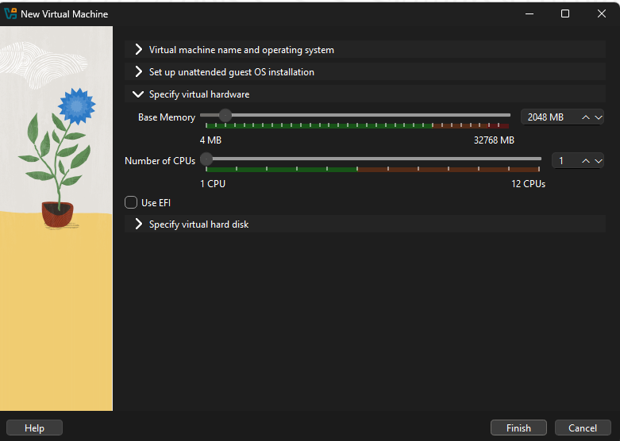
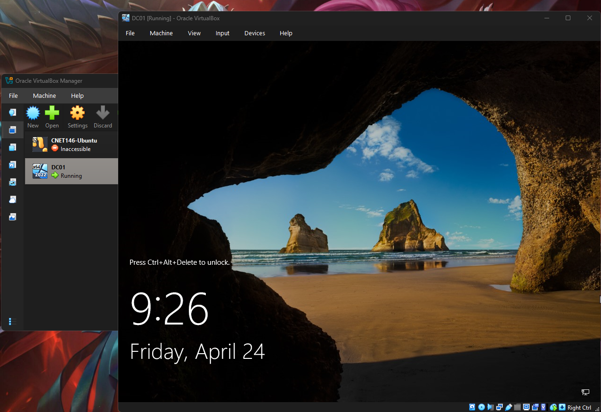

## Step 2 — Install AD Domain Services
- Opened Server Manager → Add Roles and Features
- Selected Active Directory Domain Services and installed

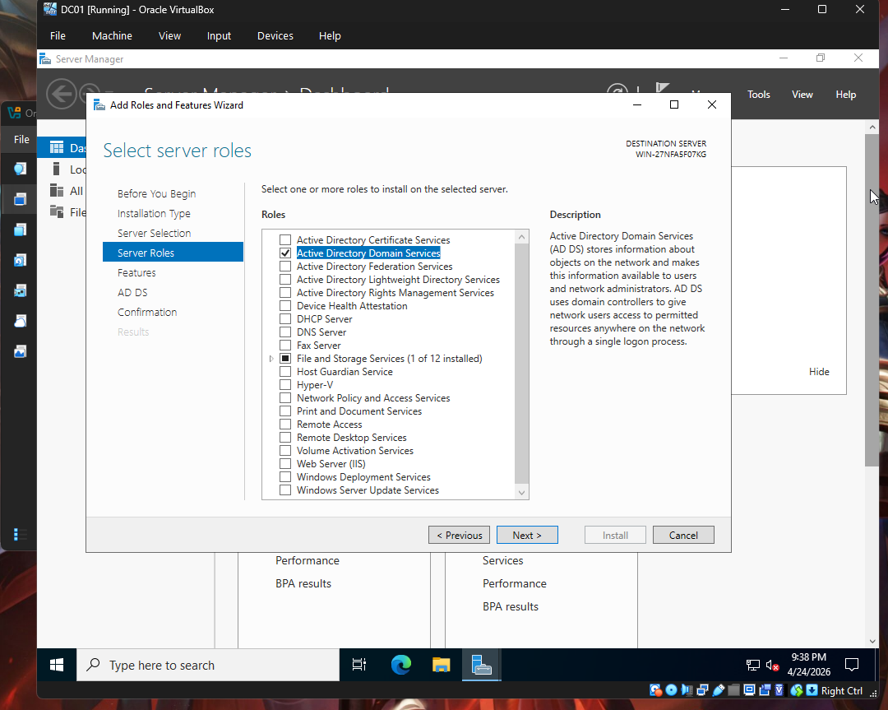
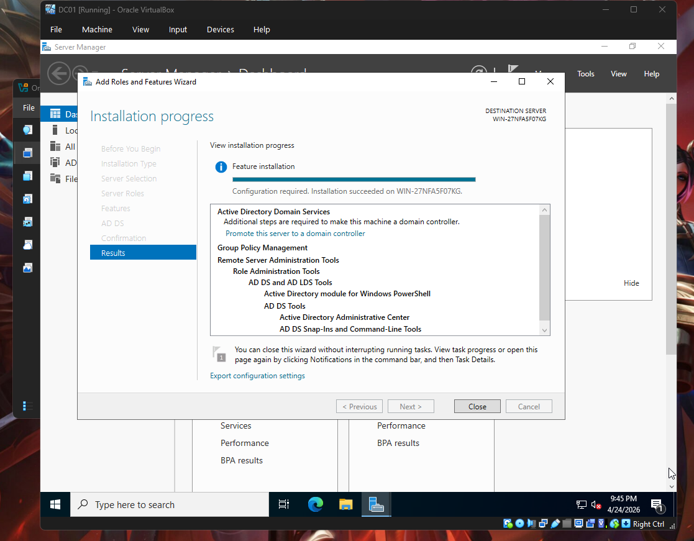

## Step 3 — Promote to Domain Controller
- Promoted server to Domain Controller
- Created new forest: chamizo.justin
- Set DSRM password

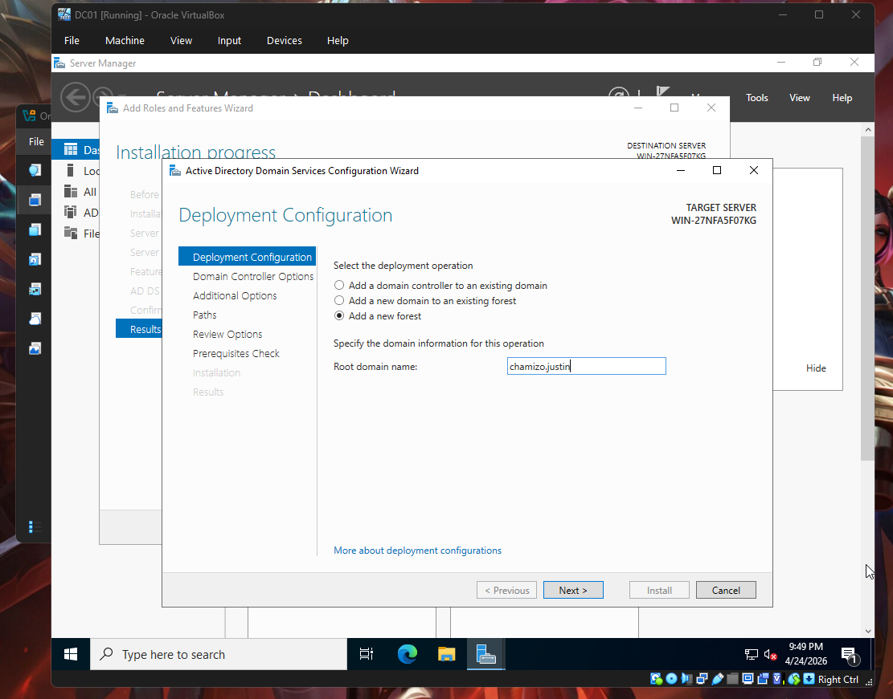
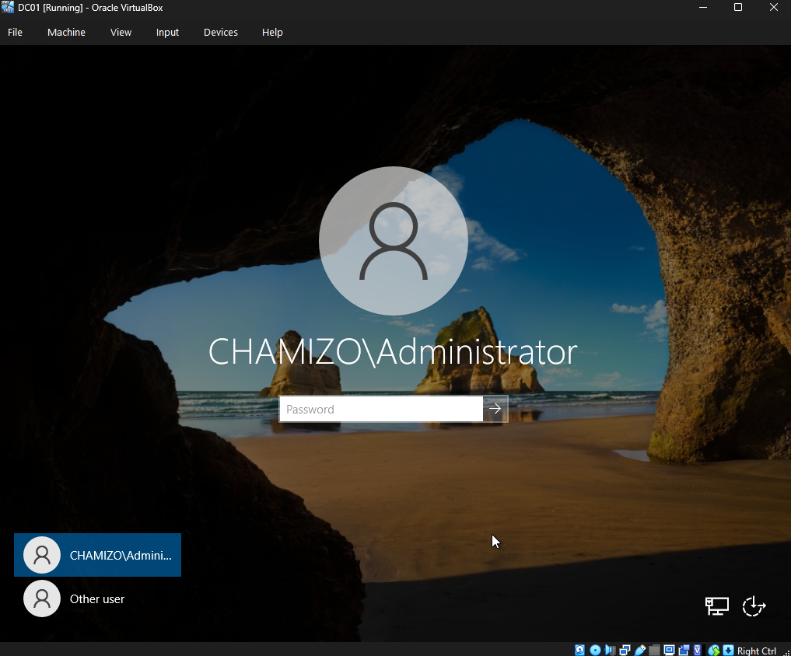

## Step 4 — Create Organizational Units
Created three OUs to simulate a real company structure:
- IT
- HR
- Finance

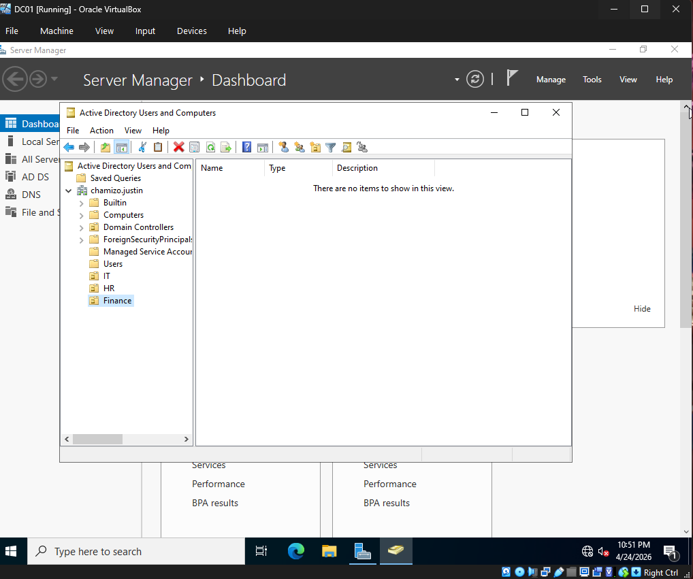

## Step 5 — Create User Accounts
Created user accounts across departments:

| Username | Department | Role |
|---|---|---|
| jsmith | IT | IT Admin |
| mwilliams | HR | HR Manager |
| tdavis | Finance | Accountant |

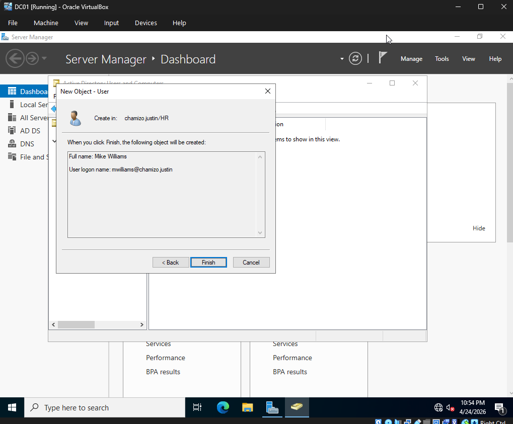
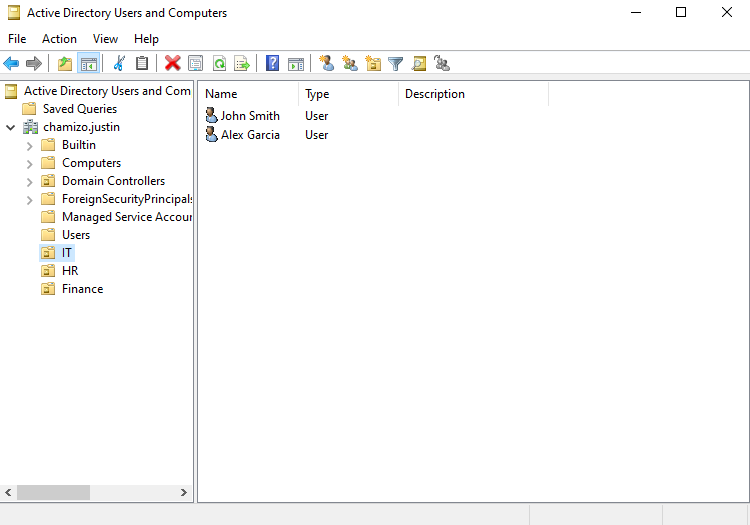
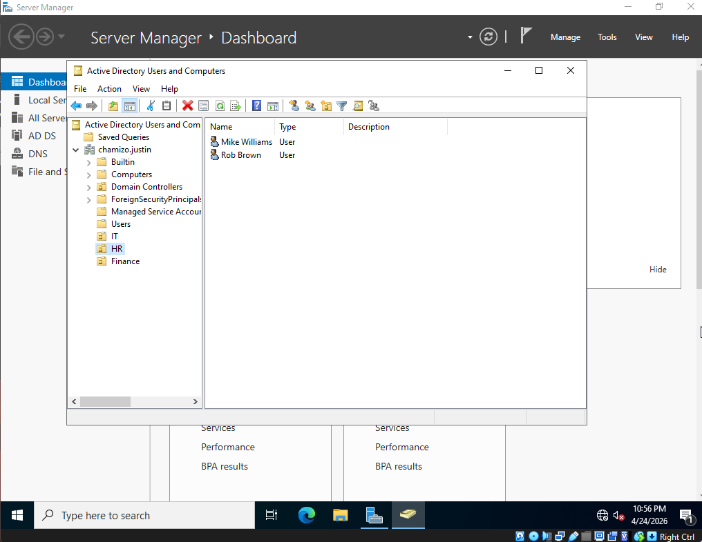
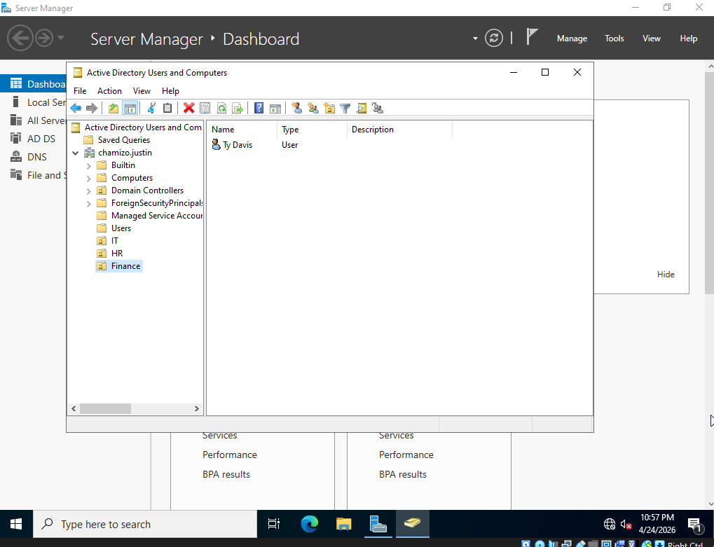

## Step 6 — Configure Group Policy Objects
Applied the following GPOs:
- Password must be 12+ characters
- Account lockout after 5 failed attempts
- USB drives disabled on all workstations

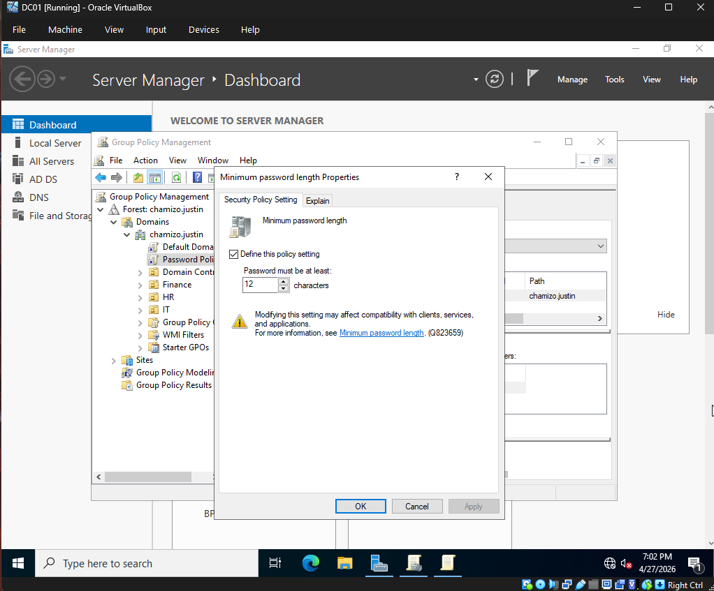
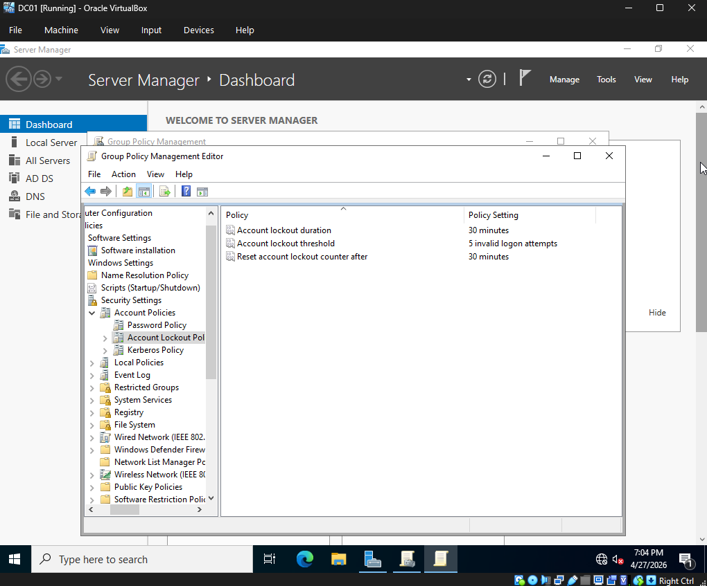
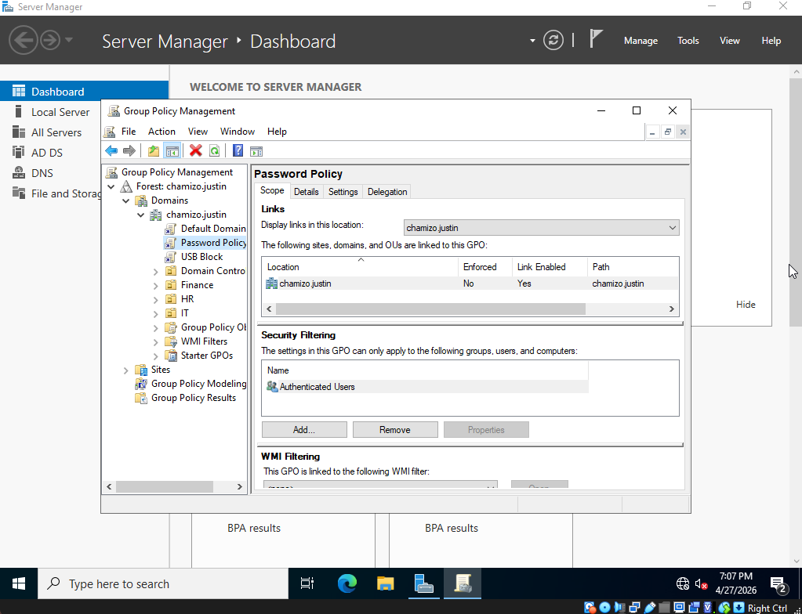

## Step 7 — Join Windows 10 to Domain

### Setup
- Downloaded Windows 10 Pro ISO from Microsoft
- Created WS01 VM in VirtualBox with 4096MB RAM, 40GB storage
- Set network adapter to Host-Only to match DC01

### Network Verification
- Ran ipconfig on DC01 to confirm IP address: 192.168.56.101
- Set WS01 DNS to point to DC01 IP: 192.168.56.101
- Pinged DC01 from WS01 to verify connectivity

### Joining the Domain
- Opened System Properties on WS01
- Changed computer name to WS01
- Selected Domain and entered chamizo.justin
- Authenticated as domain Administrator

### Verification
- Restarted WS01 after successful domain join
- Logged in as domain user jsmith from chamizo.justin
- Confirmed domain user can authenticate through DC01

### Key Takeaways
- WS01 is now fully managed by the chamizo.justin domain
- Domain users created on DC01 can log into WS01
- Group Policies from DC01 will apply to WS01 automatically
- This simulates a real enterprise environment where IT 
  manages all workstations centrally through Active Directory
