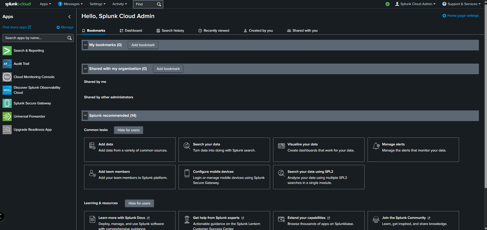
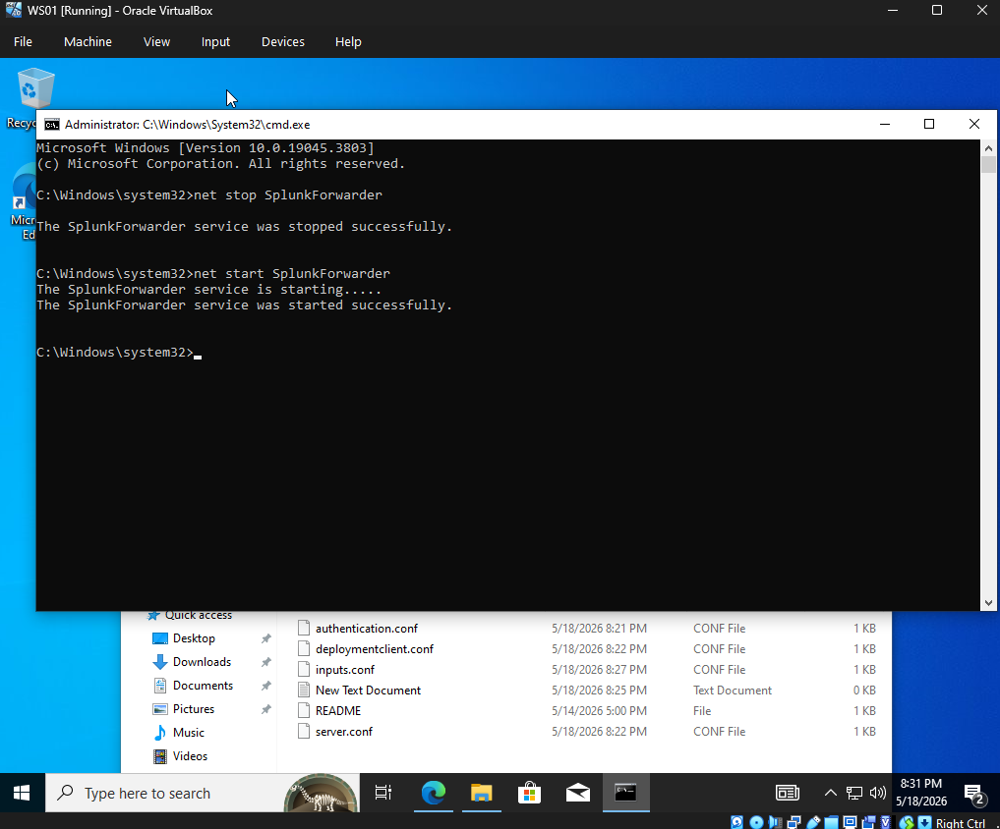

# Detection & Defense — Splunk SIEM

## Overview
Splunk Cloud was configured as the SIEM solution to monitor 
the lab environment and detect attack techniques performed 
during the offensive phase. A Splunk Universal Forwarder 
was installed on WS01 to ship Windows Event Logs to Splunk Cloud.

## Architecture
| Component | Machine | Details |
|---|---|---|
| Splunk Cloud (SIEM) | Cloud | splunkcloud.com |
| Splunk Universal Forwarder | WS01 | 192.168.56.102 |
| Attacker | Kali Linux | 192.168.56.103 |

## Setup

### Step 1 — Splunk Cloud Configuration
- Created free Splunk Cloud account
- Configured Search & Reporting for log analysis
- Set up receiving to accept forwarded logs from WS01



### Step 2 — Universal Forwarder Installation on WS01
- Downloaded Splunk Universal Forwarder for Windows 64-bit
- Installed and configured forwarder to send logs to Splunk Cloud
- Configured inputs.conf to forward Security, System, 
  and Application Windows Event Logs



### inputs.conf Configuration
```
[WinEventLog://Security]
index = main
disabled = false

[WinEventLog://System]
index = main
disabled = false

[WinEventLog://Application]
index = main
disabled = false
```

### Step 3 — Forwarder Service Verified
Successfully stopped and restarted the SplunkForwarder 
service on WS01 to apply configuration changes:
```
net stop SplunkForwarder
net start SplunkForwarder
```

---

## Detection Rules Designed

The following Splunk detection rules were designed based on 
the attack techniques performed in the offensive phase. 
These rules use Windows Event Log data forwarded from WS01.

---

### Detection 1 — Brute Force Login Attempts
**Event Code:** 4625 (Failed Logon)

**What it detects:** Multiple failed login attempts from 
the same account indicating a brute force attack

**Splunk Search:**
```
index=main EventCode=4625 
| stats count by Account_Name 
| where count > 3
```

**Alert:** Triggers when more than 3 failed logins 
detected from the same account in real time

**Why it matters:** Brute force attacks are one of the 
most common initial access techniques. Early detection 
allows security teams to lock accounts and block IPs 
before access is gained.

---

### Detection 2 — New User Account Created
**Event Code:** 4720 (User Account Created)

**What it detects:** Any new user account creation 
which could indicate an attacker establishing persistence

**Splunk Search:**
```
index=main EventCode=4720
```

**Alert:** Triggers immediately on any new account creation

**Why it matters:** Attackers often create backdoor accounts 
after gaining access to maintain persistence even if their 
initial access is discovered and removed.

---

### Detection 3 — Privileged Group Modification
**Event Codes:** 4728, 4732, 4756

**What it detects:** Users being added to privileged 
groups like Domain Admins or Administrators

**Splunk Search:**
```
index=main EventCode=4728 OR EventCode=4732 OR EventCode=4756
```

**Alert:** Triggers immediately on any privileged group change

**Why it matters:** Privilege escalation is a key step 
in most attacks. Adding accounts to admin groups is a 
strong indicator of compromise.

---

### Detection 4 — Kerberoasting Activity
**Event Code:** 4769 (Kerberos Service Ticket Request)

**What it detects:** Excessive Kerberos service ticket 
requests using RC4 encryption — a strong indicator 
of Kerberoasting

**Splunk Search:**
```
index=main EventCode=4769 Ticket_Encryption_Type=0x17 
| stats count by Account_Name 
| where count > 5
```

**Alert:** Triggers when more than 5 RC4 Kerberos 
ticket requests detected from same account

**Why it matters:** Kerberoasting was successfully 
performed in the offensive phase of this lab. This 
detection rule would have identified the attack by 
flagging the unusual volume of service ticket requests.

---

## Detection Summary

| Attack Technique | Event Code | Detection Rule | Status |
|---|---|---|---|
| Brute Force | 4625 | Failed logon count > 3 | ✅ Designed |
| New Account Creation | 4720 | Any new account | ✅ Designed |
| Privilege Escalation | 4728/4732/4756 | Group modification | ✅ Designed |
| Kerberoasting | 4769 | RC4 ticket requests > 5 | ✅ Designed |

## Key Takeaways
- A SIEM like Splunk is essential for detecting attacks 
  that may not trigger traditional antivirus or firewall alerts
- Kerberoasting generates minimal network noise making 
  SIEM detection via event logs critical
- Windows Event Logs contain rich security data that when 
  properly forwarded and analyzed can detect most common 
  attack techniques
- Defense in depth combining endpoint logging, SIEM alerting, 
  and network monitoring provides the best detection coverage

## Next Steps
- Complete Universal Forwarder connection to Splunk Cloud
- Validate detection rules by re-running attack techniques
- Build dashboards to visualize security events over time
- Expand monitoring to include DC01 logs for AD-specific detections
