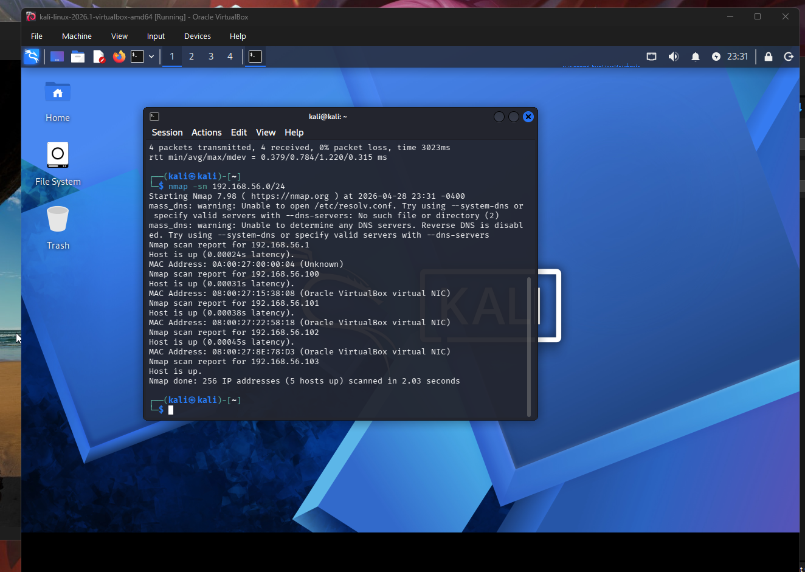
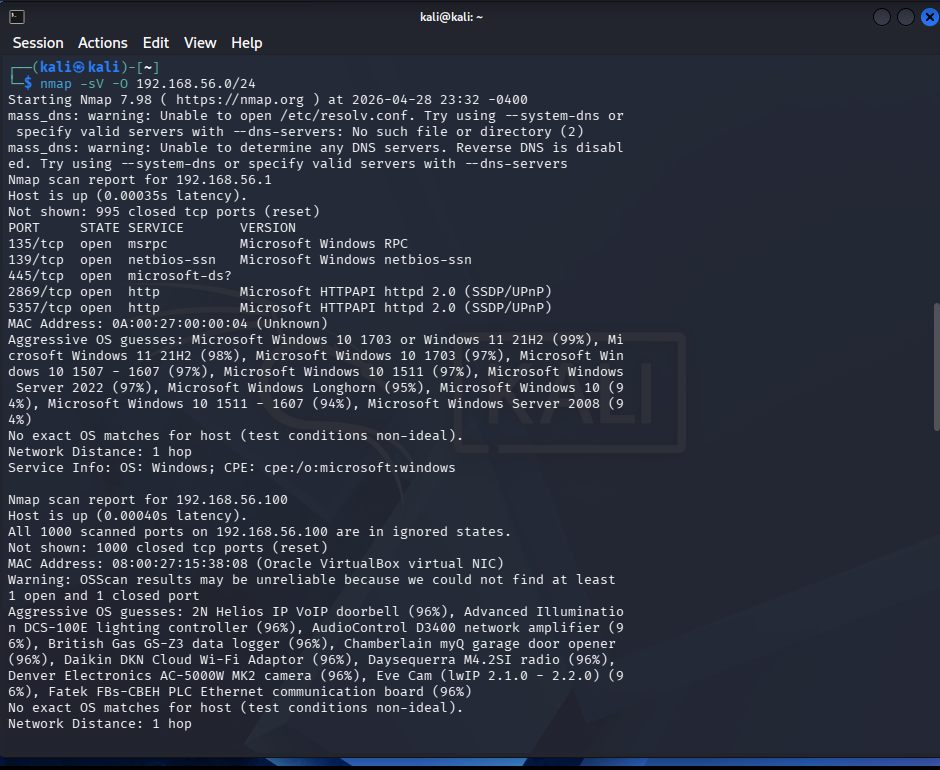
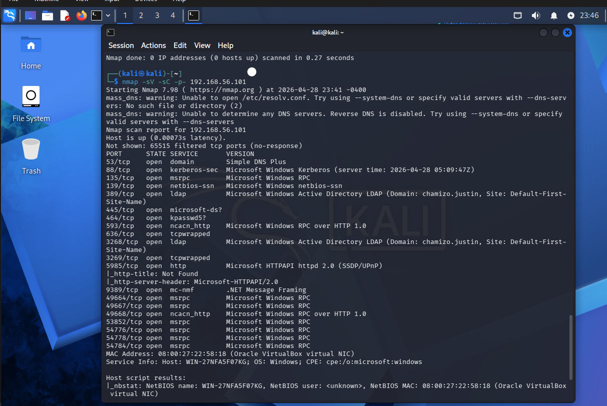
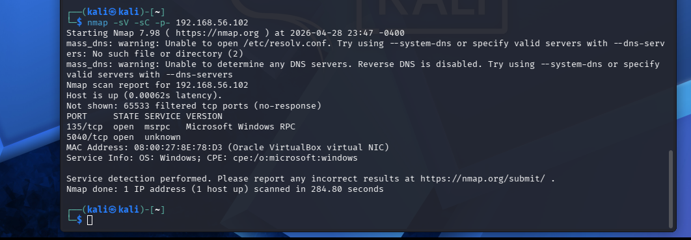
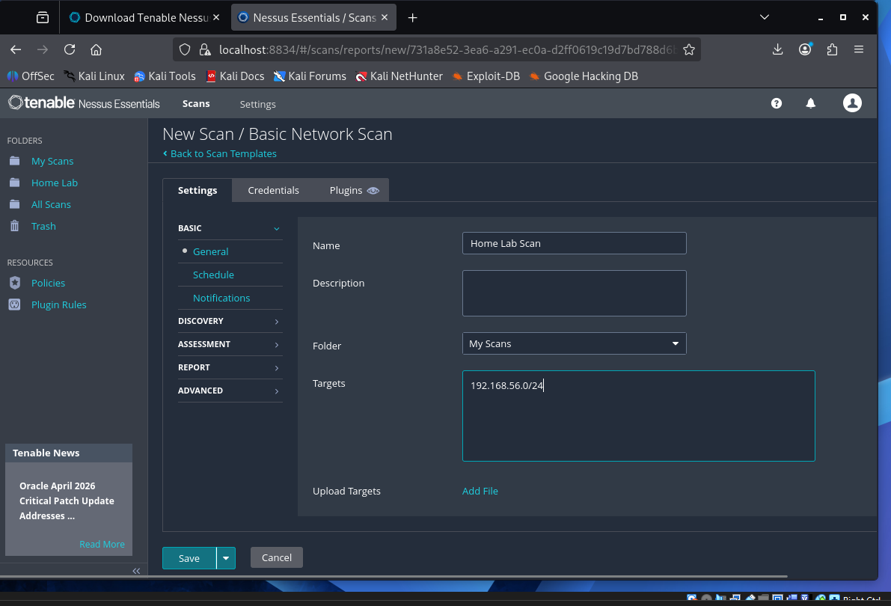
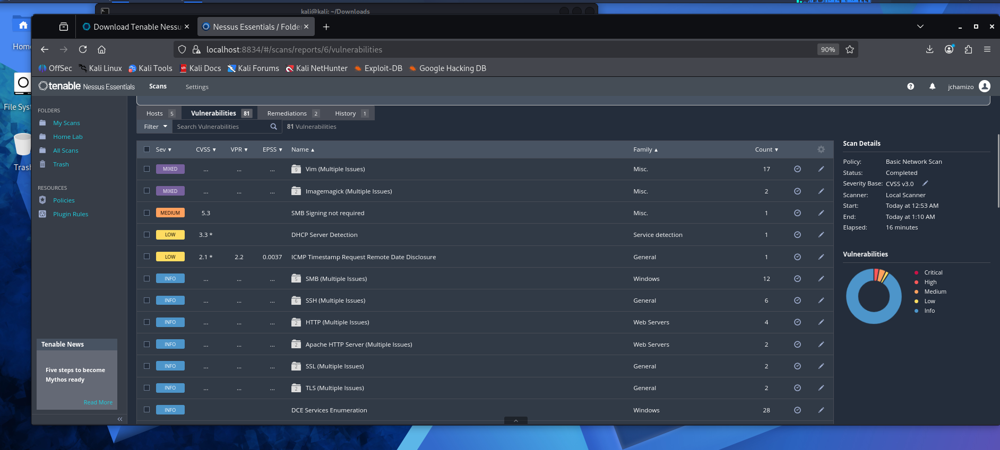
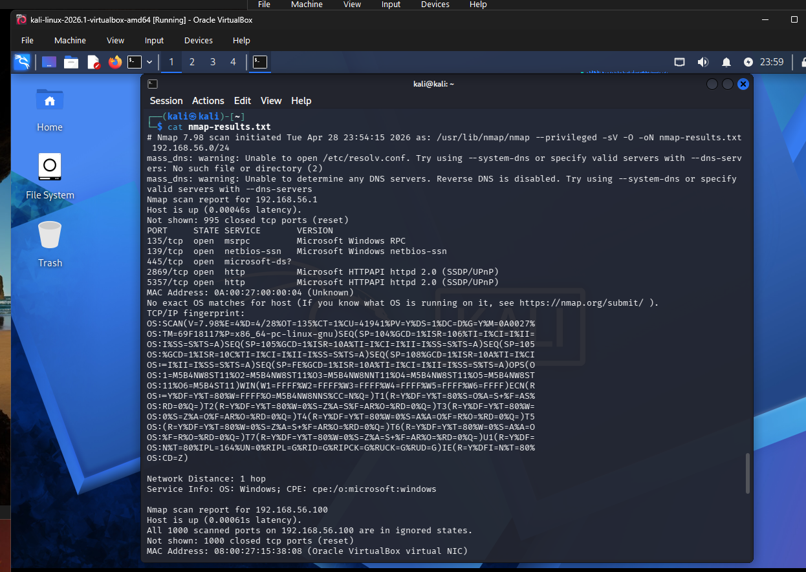

# Reconnaissance

## Objective
Identify all live hosts, open ports, running services, and 
operating systems on the lab network before exploitation.

## Environment
| Host | IP Address | Role |
|---|---|---|
| Kali Linux | 192.168.56.103 | Attacker |
| DC01 | 192.168.56.101 | Domain Controller |
| WS01 | 192.168.56.102 | Victim Workstation |

## Step 1 — Host Discovery
Command:
nmap -sn 192.168.56.0/24

## Step 2 — Service and Version Scan
Command:
nmap -sV -O 192.168.56.0/24

## Step 3 — Targeted DC01 Scan
Command:
nmap -sV -sC -p- 192.168.56.101

## Step 4 — Targeted WS01 Scan
Command:
nmap -sV -sC -p- 192.168.56.102

## Key Findings
| Host | Open Ports | Services | Risk Level |
|---|---|---|---|
| DC01 | 53, 88, 135, 389, 445 | DNS, Kerberos, SMB, LDAP | High |
| WS01 | 135, 445 | RPC, SMB | High |

## What This Means
- Port 445 (SMB) open on both machines —
  primary target for EternalBlue exploitation
- Kerberos running on DC01 confirms Active Directory
  is active — target for Kerberoasting attack
- No firewall blocking internal traffic between machines
- These findings will guide the exploitation phase

## Nessus Vulnerability Scan

## Saved Output

